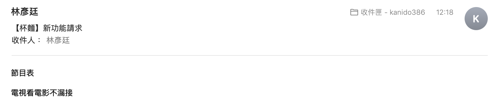

<p align=center>
    
</p>

<p align=center>
    <a target="_blank" href="https://img.shields.io/github/pipenv/locked/python-version/kanido386/baymax-with-us" title="Python version"></a>
    <a target="_blank" href="https://opensource.org/licenses/MIT" title="License: MIT"></a>
    <a target="_blank" href="http://makeapullrequest.com" title="PRs Welcome"></a>
</p>

> 基於 LINE Bot 的生活小幫手

## 功能

這邊主要分享所有功能的 demo，至於我是怎麼實作的，可以看我<a target="_blank" href="https://kanido386.github.io" title="卡尼多隨筆">部落格</a>裡的「<a target="_blank" href="https://kanido386.github.io/2021/07/baymax-with-us/">喜歡《大英雄天團》杯麵？何不自己做一個！</a>」這一篇文。

---

### 指定聽歌
在 LINE 裡面用 YouTube 輕鬆聽你想聽的歌曲。
```
> 聽 [誰的] [歌曲名]
```
<details>
<summary>想聽王藍茵的惡作劇？</summary>
<br>

</details>
<mark>↑ 點按三角形可以展開哦～</mark>

---

### 隨機聽歌
隨機聽 KKBOX 排行榜上的歌曲。
```
> 隨機聽
```
<details>
<summary>常聽就那幾首，想來點不一樣的？</summary>
<br>

</details>

---

### 做運動
跟著教學影片做運動。
```
> 做運動
```
<details>
<summary>坐太久想活動活動筋骨，卻無所適從？</summary>
<br>

</details>

---

### 查證訊息
用可信度高的查證管道明辨是非。
```
> 查證 [可疑訊息]
```
<details>
<summary>懷疑收到的訊息是真是假？</summary>
<br>

</details>

---

### 玩遊戲
隨機玩小品遊戲。
```
> 玩遊戲
```
<details>
<summary>很無聊想殺時間，卻也懶得找遊戲？</summary>
<br>

</details>

---

### 查天氣
直接在 LINE 裡面 google 天氣。
```
> [地點] 天氣
```
<details>
<summary>新莊天氣怎麼樣？</summary>
<br>

</details>

---

### 請求新功能
請求開發者做想要的新功能。
```
> 新功能 [名稱] [描述]
```
<details>
<summary>希望有個節目表的功能？</summary>
<br>

<br>
請求內容會寄到我這邊哦～

</details>

---

### 功能一覽
看有哪些功能。
```
> 功能
```
<details>
<summary>想一窺目前有哪些功能？</summary>
<br>

</details>

---

## Reference

[chonyy/daily-nba](https://github.com/chonyy/daily-nba)

## License

MIT © [kanido386](https://github.com/kanido386)